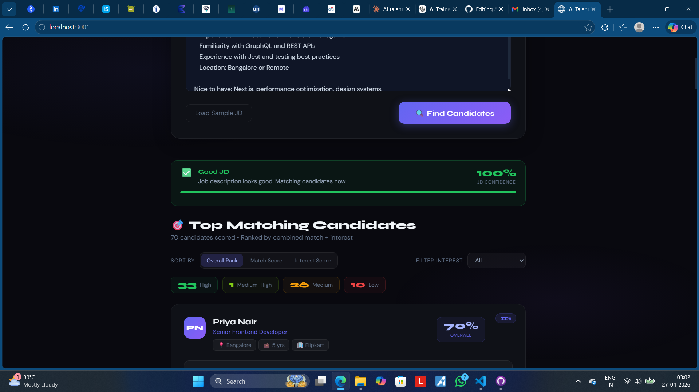
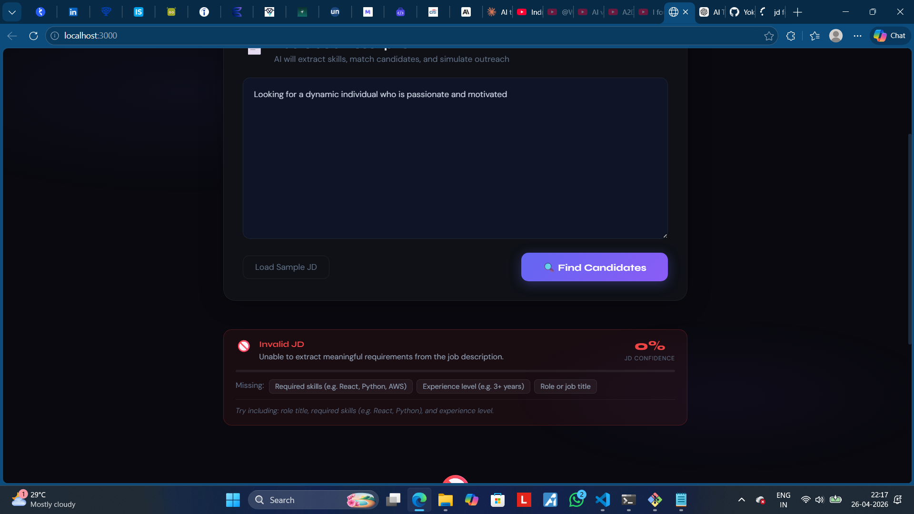
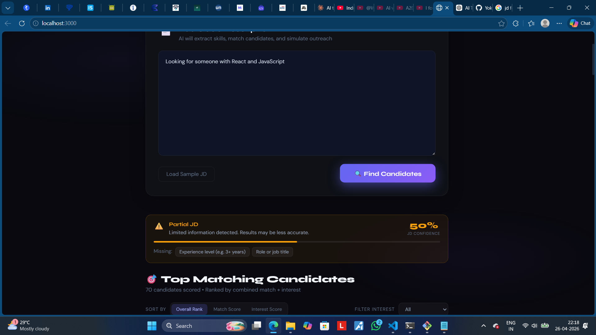
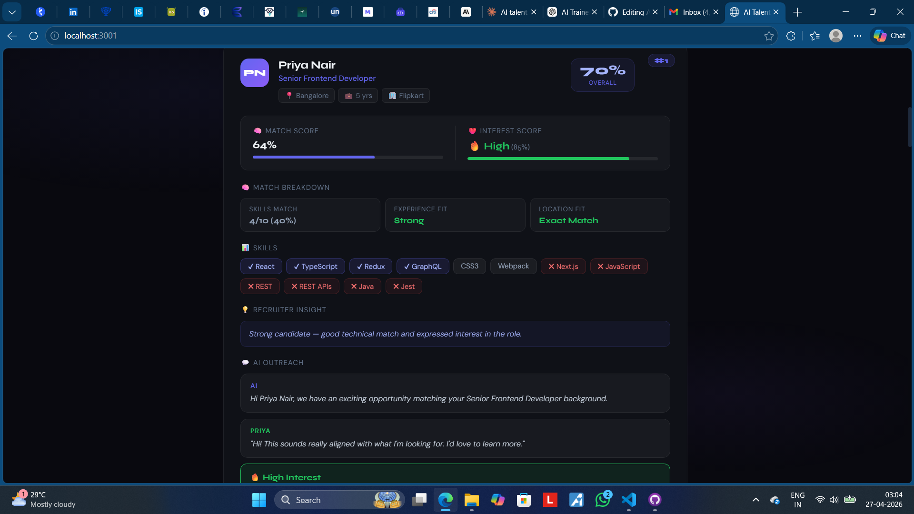
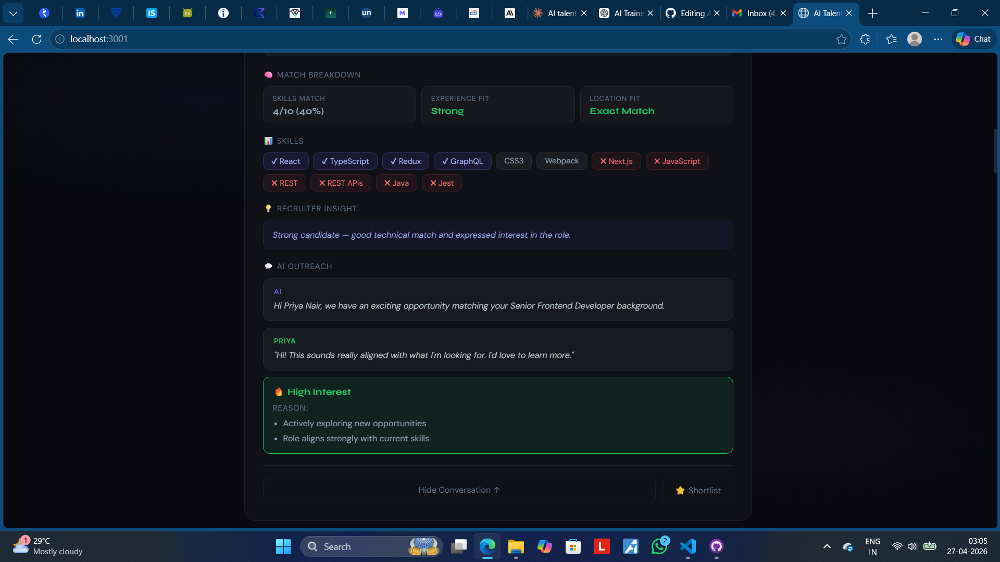
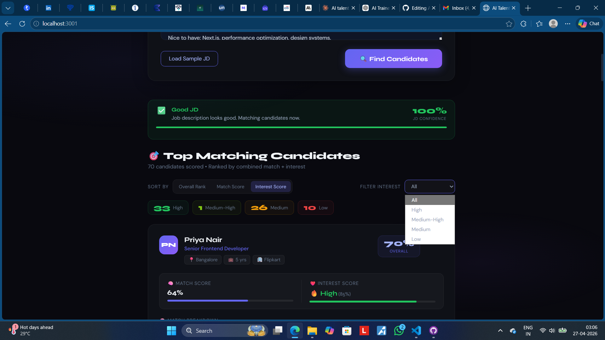
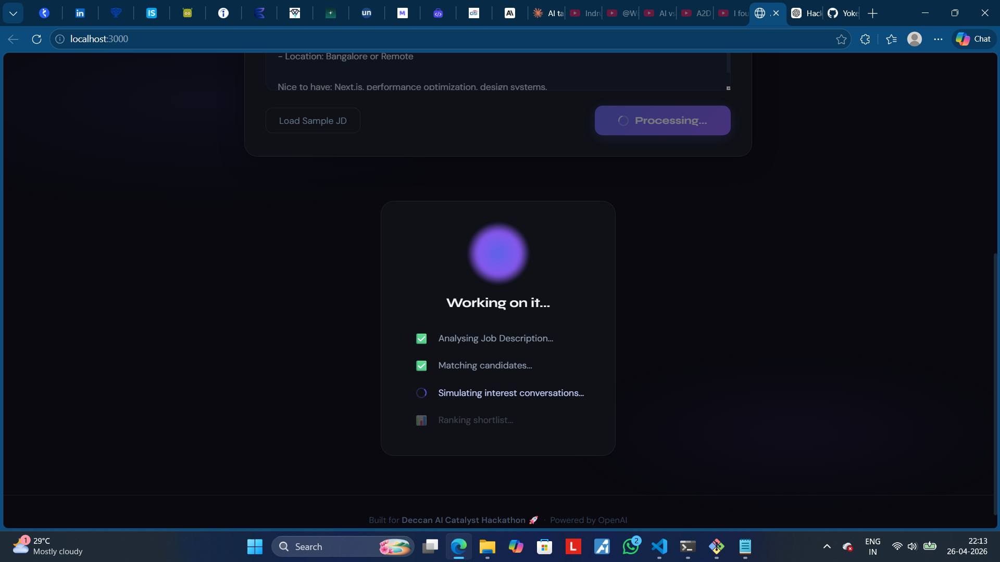

# ⚡ AI Talent Scout

**AI-powered recruiter agent that finds, evaluates, and engages candidates from a Job Description.**

Built for the **Deccan AI Catalyst Hackathon 🚀**

---

## 🧠 Problem

Recruiters spend hours manually:

* Filtering candidate profiles
* Evaluating skill fit
* Following up to check interest

This process is **slow, inconsistent, and inefficient**.

---

## 💡 Solution

AI Talent Scout automates the workflow by:

1. Parsing a Job Description
2. Matching candidates intelligently
3. Simulating recruiter outreach
4. Scoring candidates on:

   * 🧠 Match Score (fit)
   * ❤️ Interest Score (likelihood to respond)
5. Producing a **ranked, explainable shortlist**

---

## 🚀 Key Features

### 🔍 Intelligent JD Parsing

* Extracts skills, experience, and role context using AI
* Handles **incomplete or noisy job descriptions**

---

### ⚠️ Robust Input Validation 

* Detects **garbage / low-quality JDs**
* Prevents misleading results
* Shows:

  * ❌ Invalid JD → no results generated
  * ⚠️ Partial JD → low-confidence warning

---

### 🧠 Explainable Matching

* Scores candidates using:

  * Skills match
  * Experience alignment
  * Location fit
* Displays **why a candidate was selected**

---

### ❤️ Interest Simulation (AI-Powered)

* Simulates recruiter outreach conversations
* Generates:

  * Realistic candidate responses
  * Interest level (High / Medium / Low)
  * Reasoning behind interest

---

### 📊 Smart Ranking System

* Final score combines:

  * Match Score
  * Interest Score
* Top candidates highlighted with:

  * 💡 Recruiter insights

---

### 🎯 Interactive UI

* Sort by:

  * Rank
  * Match Score
  * Interest Score
* Filter candidates by interest level
* Progressive loading (performance-friendly)

---

### 🛡️ Fault-Tolerant Design (🔥 Engineering Strength)

* Handles API failures gracefully
* Uses fallback data if LLM fails
* Prevents crashes and ensures smooth UX

---

## 🧮 Scoring Formula

| Metric         | Formula                                          |
| -------------- | ------------------------------------------------ |
| Match Score    | 0.6 × Skills + 0.3 × Experience + 0.1 × Location |
| Interest Score | AI-generated (10–95)                             |
| Rank Score     | 0.7 × Match + 0.3 × Interest                     |

---

## ⚙️ How It Works

1. **Parse JD**
   AI extracts structured data (skills, experience, role)

2. **Validate Input**
   Detects invalid or incomplete job descriptions

3. **Match Candidates**
   70 mock candidates scored using JS logic

4. **Simulate Interest**
   Top candidates processed with AI outreach simulation

5. **Rank & Display**
   Results sorted and rendered with explanations

---

## 📥📤 Sample Input & Output

### 📥 Input (Job Description)
Frontend Developer with React, JavaScript, 2–4 years experience, Chennai or Remote.

---

### 📤 Output (Top Candidates)

1. **Rahul Sharma**  
   - Match Score: 82%  
   - Interest: High  
   - Insight: Strong skill alignment and actively exploring opportunities  

2. **Priya Nair**  
   - Match Score: 78%  
   - Interest: Medium-High  
   - Insight: Good match, but evaluating multiple roles  

3. **Karthik R**  
   - Match Score: 74%  
   - Interest: Medium  
   - Insight: Open depending on role flexibility  

---

### Each candidate includes:
- Match breakdown (skills, experience, location)
- AI-generated interest simulation
- Explainability insights for decision-making

---
## 📸 Screenshots
###  🏠Input & Validation

Paste a job description and get instant feedback on its quality.

Detects invalid or low-quality JDs
Shows confidence warnings before processing



###  ⚠️ Garbage / Invalid JD Handling

Prevents misleading results when JD lacks meaningful data.




###  🎯Ranked Candidate Results

Clean, structured cards showing match score, interest level, and explanations.



###  🧠 Explainability & Insights

Each candidate includes reasoning:

Why were they selected
Interest simulation explanation



###  🔍 Sorting & Filtering

Recruiters can:

Sort by rank, match score, or interest
Filter candidates by interest level



###  ⏳ Processing Flow

Step-by-step loading state showing pipeline progress.




---

## 🏗️ Architecture


```plaintext
+----------------------+
|   User Input (JD)    |
+----------+-----------+
           ↓
+----------------------+
|   JD Parser (LLM)    |
+----------+-----------+
           ↓
+----------------------+
|  Validation Layer    |
+----------+-----------+
           ↓
+----------------------+
| Matching Engine (JS) |
+----------+-----------+
           ↓
+-------------------------------+
| Interest Simulator (LLM + FB) |
+----------+--------------------+
           ↓
+----------------------+
|  Ranking Engine      |
+----------+-----------+
           ↓
+----------------------+
|   UI (React App)     |
+----------------------+
```
This architecture combines AI reasoning with deterministic logic:

- LLM handles **understanding and simulation** (JD parsing, interest generation)
- JavaScript handles **scoring and ranking** (fast, reliable, and explainable)
- Validation ensures robustness against poor or noisy job descriptions
- Fallback logic guarantees the system continues working even if AI fails

---

## 📁 Project Structure

```
ai-talent-scout/
├── components/        # UI components
├── services/          # Pipeline + AI logic
├── utils/             # Scoring + helpers
├── data/              # Mock candidate dataset
├── config/            # Configurable constants
```

---

## 🚀 Quick Start

### Prerequisites

* Node.js 18+
* npm
* OpenAI API key

### Install

```bash
npm install
npm install express http-proxy-middleware cors dotenv
```

### Configure API

```bash
cp .env.example .env
# Add your key
OPENAI_API_KEY=sk-xxxx
```

### Run

```bash
node proxy-server.js
npm start
```

---

## 🧪 Edge Cases Handled

* ❌ Invalid JD (no skills/experience)
* ⚠️ Partial JD (low-confidence results)
* 🔌 API failure (fallback responses used)
* 📉 No matching candidates
* 🔄 Repeated queries (cached / optimized)

---

## 🎬 Demo

👉 Paste a job description
👉 Click “Find Candidates”
👉 View ranked, explainable results instantly

---

## 🧠 Why This Stands Out

* Not just AI — **practical recruiter workflow automation**
* Combines **logic + LLM intelligently**
* Handles **real-world messy inputs**
* Designed as a **usable product, not a demo**

---

## 🎨 Tech Stack

* React 18
* OpenAI (gpt-4o-mini)
* Express (proxy server)
* Vanilla CSS

---

## 🏁 Final Note

This project focuses on:

> **Clarity, reliability, and real-world usability over complexity**

---

Built with focus, pressure, and a bit of obsession. 🚀
