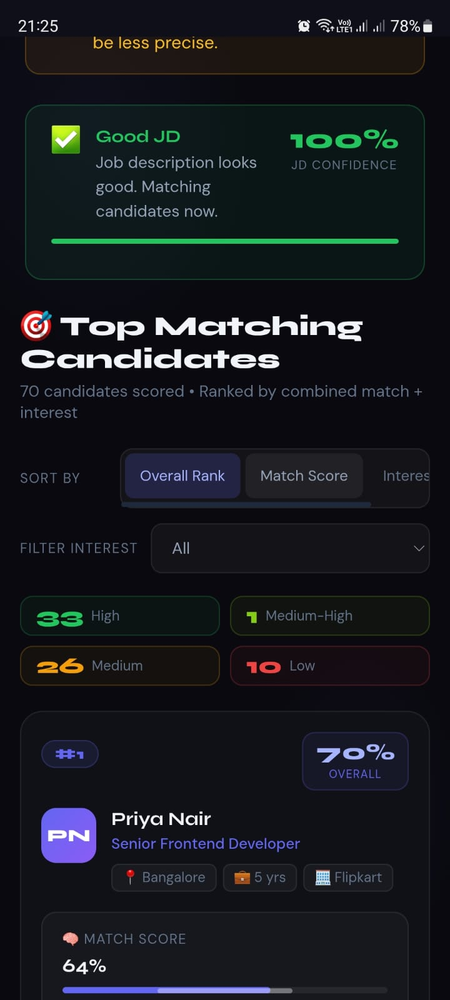
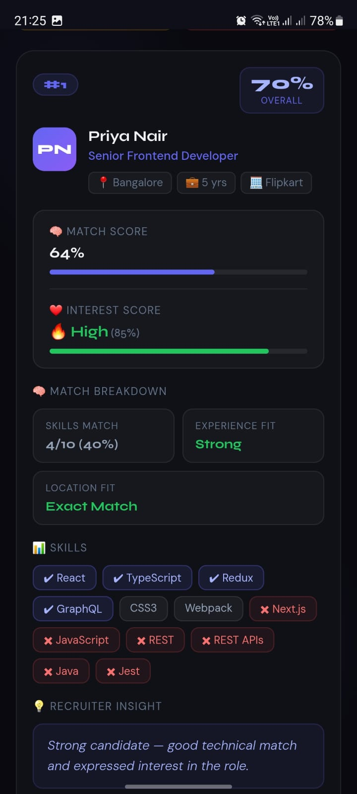

# ⚡ AI Talent Scout

**AI-powered recruiter agent that doesn't just find candidates — it finds the *right* ones who are actually interested.**

Built for the **Deccan AI Catalyst Hackathon 🚀**

---

## 🌐 Live Demo

👉 https://ai-talent-scout-rho.vercel.app/

---

## 🧠 Why This Matters

Hiring isn't just about finding qualified candidates.

It's about finding candidates who:

* ✔ Fit the role
* ✔ Are genuinely interested
* ✔ Will actually respond

Most tools solve the first problem.
**AI Talent Scout solves all three.**

---

## 🧠 Problem

Recruiters spend hours:

* Filtering profiles
* Evaluating skill fit
* Following up manually

Despite this effort:

* Many candidates never respond
* Interest is unknown until late
* Time is wasted on low-intent leads

👉 The missing piece: **intent**

---

## 💡 Solution

AI Talent Scout automates the recruitment workflow by:

1. Parsing a Job Description
2. Matching candidates intelligently
3. Simulating recruiter outreach
4. Scoring candidates on:

   * 🧠 Match Score (fit)
   * ❤️ Interest Score (likelihood to respond)
5. Producing a **ranked, explainable shortlist**

👉 Result: A shortlist that is not just accurate — but actionable.

---

## 🚀 Key Features

Designed to simulate a real recruiter workflow — not just a scoring engine.

### 🔍 Intelligent JD Parsing

* Extracts skills, experience, and role context using AI
* Handles incomplete or noisy job descriptions

---

### ⚠️ Robust Input Validation

* Detects garbage / low-quality JDs
* Prevents misleading results
* Shows:

  * ❌ Invalid JD → no results
  * ⚠️ Partial JD → low-confidence warning

---

### 🧠 Explainable Matching

* Scores candidates using:

  * Skills match
  * Experience alignment
  * Location fit
* Displays **why a candidate was selected**

---

### ❤️ Interest Simulation (AI-Powered)

* Simulates recruiter outreach conversations
* Generates:

  * Realistic candidate responses
  * Interest level (High / Medium / Low)
  * Reasoning behind interest

---

### 📊 Smart Ranking System

* Combines:

  * Match Score
  * Interest Score
* Highlights top candidates with insights

---

### 🎯 Interactive UI

* Sort by rank, match score, or interest
* Filter candidates by interest level
* Smooth, responsive experience

---

### 🛡️ Fault-Tolerant Design

* Handles API failures gracefully
* Uses fallback data if AI fails
* Prevents crashes

---

## 📸 Screenshots

### 🏠 Input & Validation


---

### ⚠️ Invalid / Partial JD Handling


---

### 🎯 Ranked Candidate Results


---

### 🧠 Explainability & Insights


---

### 🔍 Sorting & Filtering


---

### ⏳ Processing Flow


---

### 📱 Mobile UI — Input Experience



---
### 📱 Mobile UI — Candidate Results



---

## 🔥 What Makes This Different

Most AI tools focus on prediction.

This system focuses on:

* ✔ Decision-making
* ✔ Explainability
* ✔ Recruiter usability

It combines:

* LLMs → understanding & simulation
* JavaScript → scoring & reliability

👉 Built like a product, not just a demo.

---

## 🧮 Scoring Formula

| Metric         | Formula                                          |
| -------------- | ------------------------------------------------ |
| Match Score    | 0.6 × Skills + 0.3 × Experience + 0.1 × Location |
| Interest Score | AI-generated (10–95)                             |
| Rank Score     | 0.7 × Match + 0.3 × Interest                     |

---

## ⚙️ How It Works

1. Parse JD → Extract structured data
2. Validate → Detect poor input
3. Match → Score candidates
4. Simulate → AI generates interest
5. Rank → Display best candidates

---

## 🏗️ Architecture

```
User Input → JD Parser → Validation → Matching Engine  
→ Interest Simulation → Ranking Engine → UI
```

---

## 📁 Project Structure

```
ai-talent-scout/
├── components/
├── services/
├── utils/
├── data/
├── config/
```

---

## 🚀 Quick Start

### Prerequisites

* Node.js 18+
* npm
* OpenAI API Key

---

### Install

npm install
npm install express http-proxy-middleware cors dotenv

---

### Configure API

Create `.env` file:

OPENAI_API_KEY=your_key_here

---

### Run

node proxy-server.js
npm start

---

## 🧪 Edge Cases Handled

* ❌ Invalid JD
* ⚠️ Partial JD
* 🔌 API failure
* 📉 No matching candidates
* 🔄 Repeated queries

---

## 🎬 Demo

👉 Paste a job description
👉 Click “Find Candidates”
👉 View ranked results instantly

---

## 🏁 Final Note

This project focuses on:

* Real-world usability
* Clear decision-making
* Robust handling of messy inputs

> Not just AI that works —
> AI that recruiters can actually use.

---

Built with focus, pressure, and intent. 🚀
